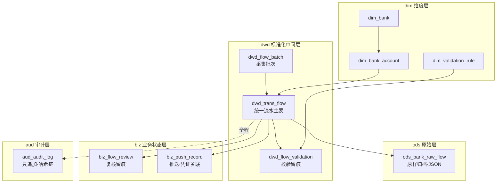

# 数据中间池表结构设计（v0.1）

> **版本**：v0.1（初稿）　**状态**：待契约冻结 8/27 回填字段口径确认
> **所有者**：数据工程师 Agent　**协作**：财务业务顾问（口径）、全栈工程师（采集/推送）、UI/UX（看板取数）
> **对应工作包**：2 数据中台落库 / 7 数据溯源机制 / 9 可视化看板（协作 1 契约 / 3 采集适配 / 8 架构骨架）

---

## 一、分工边界（以《一期分工表》为准）

| 项 | 内容 |
|-|-|
| 阶段 | 数据与采集 / 平台与可视化 |
| 工作内容 | 库表结构与分层；批次落库 + 校验留痕；可视化取数模型；数据溯源机制 |
| 工作包 | 2、7、9（协作 1、3、8） |
| 期间 | 08-27 ~ 09-15 |
| 关键交付物 | 建表脚本、溯源链路、取数视图 |

**已锁定决策（执行方案 v3，D 系列）**：

| 决策 | 结论 | 对本设计的影响 |
|-|-|-|
| D5 | 建最小结构化中间表 | 主表只存制证/可视化最小字段，非必需字段按原始流水归档 |
| D7 | 轻量关系库（MySQL/PostgreSQL） | 本设计以 MySQL 8.0 落脚本，PostgreSQL 平替见脚本文末 |
| D9 | 自研嵌入式图表 · MVP 四看板 | 取数统一走本设计的标准视图层 |

---

## 二、设计原则（对齐基线「可扩展分层」）

1. **分层解耦**：`ods 原始层 → dwd 标准化中间层 → dim 维度 → biz 业务状态 → aud 审计`，各层职责单一，可独立演进。
2. **契约版本化**：批次与流水均带 `contract_version` 字段，字段演进向后兼容，不推倒重建。
3. **采集可插拔**：MOCK / FILE / API 三源对上层只暴露统一契约字段，换源不动核心表。
4. **取数解耦**：可视化统一走 `v_*` 视图，换 BI 或自研不牵连上游采集/入账。
5. **全程留痕**：原始归档 + 校验留痕 + 复核留痕 + 推送留痕 + 只追加审计日志，满足「100% 可回溯」验收标准。

---

## 三、表清单

| 层 | 表 | 用途 | 溯源要素覆盖 |
|-|-|-|-|
| dim | `dim_bank` | 银行维度 | 来源（银行） |
| dim | `dim_bank_account` | 银行账户维度 | 来源（账户） |
| dim | `dim_validation_rule` | 校验规则字典（可扩展） | 异常口径 |
| ods | `ods_bank_raw_flow` | 原始流水原样归档 | 原始来源回链 |
| dwd | `dwd_flow_batch` | 采集批次 | 批次号 |
| dwd | `dwd_trans_flow` | 统一流水结构化主表 | 记录级 ID |
| dwd | `dwd_flow_validation` | 校验结果留痕 | 校验留痕 |
| biz | `biz_flow_review` | 人工复核留痕 | 复核人/时间 |
| biz | `biz_push_record` | 金蝶推送 + 凭证绑定 | 凭证关联 |
| aud | `aud_audit_log` | 操作审计日志 | 全程操作留痕 |

视图层（四看板取数）：`v_flow_overview` / `v_bank_distribution` / `v_exception_alert` / `v_recon_balance`。

---

## 四、核心表设计要点

### 4.1 `dwd_trans_flow`（统一流水主表）

- 落 `dedup_key`（= SHA256(bank_id|account_id|txn_no|txn_date|amount|dc_flag)）作**唯一索引**，天然支撑「R001 重复流水」检测与采集幂等。
- 统一流水契约核心八字段：`txn_no / txn_date / txn_time / currency / amount / dc_flag / counterparty_name / counterparty_account + summary`。
- `process_status` 走完整业务阶段：`LOADED → VALIDATING → REVIEW_READY → REVIEW_PASSED → PUSHED → KINGDEE_POSTED`（异常分支 `REJECTED`）。
- `ext_json` 预留扩展，未来智能科目匹配、发票联动不重建表。
- `raw_id` 回链原始归档，实现「结构化 → 原始」反向溯源。

### 4.2 `dwd_flow_batch` + `dwd_flow_validation`（批次落库 + 校验留痕）

- 批次记录 `total_count / total_amount` 为**采集适配层上报口径（预期）**，与 `v_recon_balance` 视图聚合的**实际落库量**比对，得到勾稽差异。
- 校验留痕**逐规则、逐流水**落 `dwd_flow_validation`，一条流水命中的每条规则各一行，审计可回溯到「哪个规则、哪条明细、什么原因」。

### 4.3 `aud_audit_log`（防篡改审计）

- 记录 `actor / action / entity_type / entity_id / detail / ip`。
- `row_hash = SHA256(prev_hash + 本行内容)`，`prev_hash` 链式串联，**只追加、可验证、防篡改**，满足合规审计证据要求。

---

## 五、数据溯源机制（工作包 7）

> 溯源目标：任意一笔金蝶凭证，可回查「原始流水 → 采集批次 → 复核人/时间 → 推送记录 → 凭证号」；反之任意一笔流水可查到最终凭证号。

| 溯源方向 | 链路 | 关键字段 |
|-|-|-|
| 账 → 单 | `biz_push_record.voucher_no` → `dwd_trans_flow.record_id` → `ods_bank_raw_flow.raw_id` | voucher_no、record_id、raw_id |
| 单 → 账 | `dwd_trans_flow.record_id` → `biz_push_record.voucher_no` | record_id、voucher_no（双向绑定） |
| 批量召回 | `dwd_flow_batch.batch_no` → 本批全部 `dwd_trans_flow` | batch_no / batch_id |
| 操作追溯 | `aud_audit_log`（谁、何时、做了什么） | actor / action / created_at |

---

## 六、可视化取数模型（工作包 9）

| 看板 | 视图 | 口径 | 关键聚合 |
|-|-|-|-|
| 流水总览 | `v_flow_overview` | 收/支金额、笔数、趋势 | 按账户/日/方向聚合 |
| 银行分布 | `v_bank_distribution` | 各银行/账户占比 | 按账户聚合借贷方 |
| 异常预警 | `v_exception_alert` | 超阈值/重复/负金额/缺字段 | 校验 FAIL/WARN 明细 |
| 对账钩稽 | `v_recon_balance` | 导入 vs 实际 勾稽差异 | 批次预期量 vs 落库量 |

---

## 七、关键假设与待契约冻结确认清单

以下假设已在脚本中落为默认值，**8/27 契约冻结时需与财务业务顾问最终对表确认**：

| # | 待确认项 | 当前默认 | 影响对象 |
|-|-|-|-|
| C1 | 契约核心字段清单（八字段） | 日期/金额/借贷方向/对方户名/账户/币种/摘要/流水号 | `dwd_trans_flow` |
| C2 | 金额精度 | `DECIMAL(20,2)`；外币多币种可能需 4 位 | 全部金额字段 |
| C3 | 借贷方向取值 | `D=借方/支出`、`C=贷方/收入`，需对齐金蝶口径 | `dc_flag` |
| C4 | 唯一流水号口径 | 同一 `txn_no` 是否跨账户唯一；需确认去重键组成 | `dedup_key` |
| C5 | 校验规则集与阈值 | R001–R005 种子 5 条，阈值入 `threshold_json` | `dim_validation_rule` |
| C6 | 数据库引擎 | MySQL 8.0（可平替 PostgreSQL） | 全部 DDL |
| C7 | 账户维度粒度 | 一期精确到「银行+账号」，主体/币种子账户后置 | `dim_bank_account` |

---

## 八、扩展点预留（未来不重建表）

| 未来能力 | 接入方式 | 对应设计 |
|-|-|-|
| 智能科目匹配 | 规则钩子 | `dwd_trans_flow.ext_json` + `biz_flow_review.matched_subject` |
| 新银行/数据源 | 新增维表记录 + 采集适配器 | `dim_bank` + `source_type` 枚举扩展 |
| 多币种/多主体 | 维度扩展 | `dim_bank_account` + `currency` 字段 |
| 发票联动 | 事件/扩展点 | `ext_json` + 新增关联表（不动主表） |
| 审计防篡改校验 | 哈希链重放验证 | `aud_audit_log.row_hash / prev_hash` |

---

## 九、下一步

1. 8/27 契约冻结回填 C1–C7，冻结 `dwd_trans_flow` 契约字段与 `dedup_key` 组成。
2. 08-27~09-03 提交「批次落库 + 校验 + 留痕」可跑的写入逻辑（与全栈协作，衔接采集适配层）。
3. 08-31~09-07 落地溯源链路：批次号 / 记录级 ID / 审计留痕全链路可回查（与全栈协作）。
4. 09-07~09-15 四看板取数视图上线，取数可信（与 UI/UX 协作）。