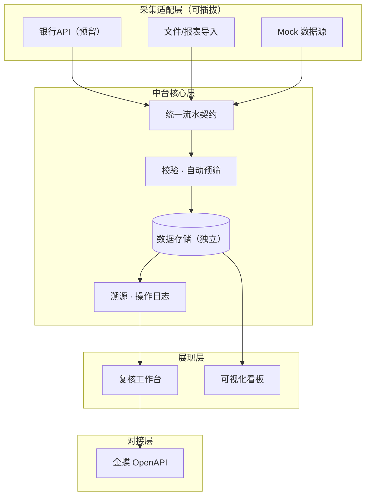
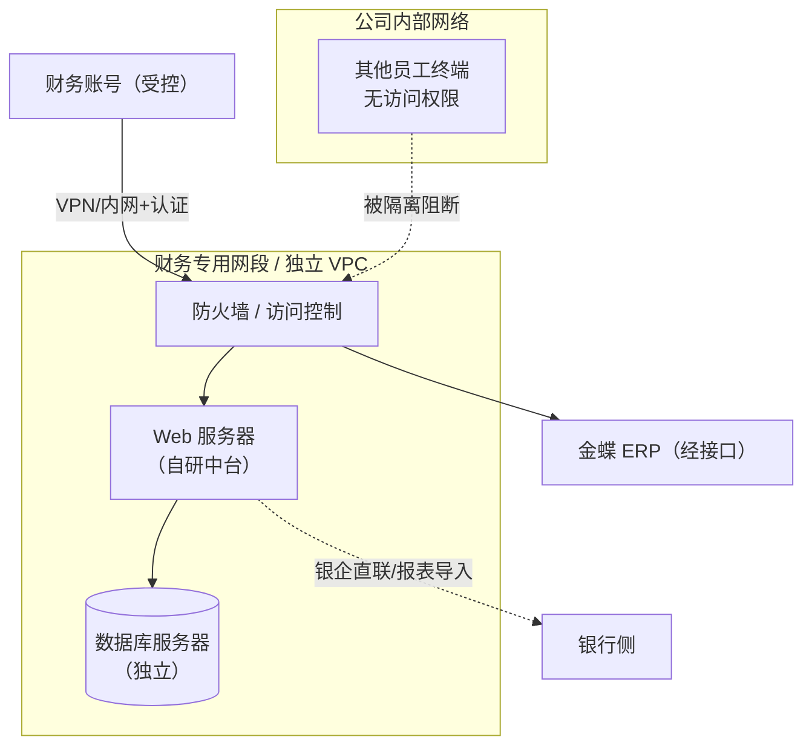
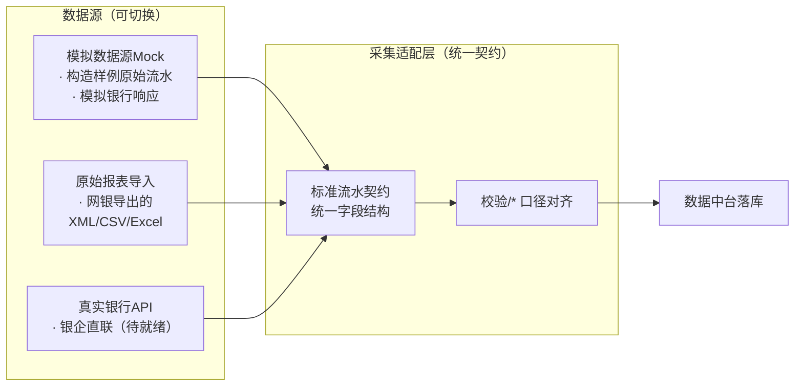

<title>财务流水自动入账项目 — 执行方案——第一期（v3）</title>

# 项目背景与约束

<callout emoji="💡">
**公司背景**：面向一家 **200+ 人的互联网公司**，财务部处理多银行（中信 & 招商等）收付款流水。账务系统统一使用 **金蝶云星空（企业版公有云）**。
</callout>

**为什么自建**：不是「再买一个工具」，而是自建数据中台作为银行流水与金蝶之间的**中转池**，统一归集、校验、复核后推送金蝶自动生成凭证，实现可控自动化（human-in-the-loop）。

**本阶段定位**：项目已立项，本文档为「怎么做」的执行方案。设计以**可扩展的系统架构**为核心目标：MVP 先打通最小闭环，同时预留清晰扩展点，便于未来增量添加功能。**本一期采用「本人单人 + AI」实施模式**：本人为唯一负责人，数据 / 采集 / UI / 测试 / 运维等职能由多角色 AI Agent 承接并可并行推进，关键决策与人工复核点仍由本人介入（见第 4 章）。本期仅实施**一期**，聚焦打通「银行 → 数据中台 → 金蝶」最小闭环，时间计划见第 10 章甘特图。

## 约束与前提

| 维度 | 前提 / 约束 | 对方案的影响 |
|-|-|-|
| **接账系统** | 金蝶云星空（公有云），经 OpenAPI 对接 | 推送通道走金蝶标准接口 |
| **公司规模** | 200+ 人互联网公司，财务为唯一使用方 | 权限默认收紧、按角色分权；并发量可控 |
| **数据安全** | 数据库与服务器独立部署，与办公网隔离，仅财务可访问 | 见第 7 章部署与安全隔离 |
| **银行接口** | 暂无银行真实 API | 采集走适配层，以模拟银行 API 为主、文件导入兜底，见第 8 章 |
| **可扩展** | 未来需增量添加功能 | 架构分层、预留扩展点，见第 6 章 |

<callout emoji="✅">
**项目状态**：本项目**已立项**。本文档进入「怎么做」的实施阶段，面向项目执行团队与财务侧协作方，明确交付物、关键路径、最小 MVP 范围、安全隔离、无真实 API 下的采集与测试方案、数据溯源机制。
</callout>

# 执行目标与成功标准

**一期总目标**：打通「银行 → 自研数据中台 → 金蝶」之间的数据链路，实现 **中信 & 招商** 银行下所有账户流水自动化，覆盖约 **80%** 流水。

## 一期分解目标

| # | 一期目标 | 落地要点 | 对应工作包 / 章节 |
|-|-|-|-|
| 1 | 自研数据库架构搭建 | 按可扩展分层建库，独立部署、权限隔离 | 工作包 2/8，第 6 章 |
| 2 | 银行接口打通：落地中信、招商对接 | 以模拟银行 API 为主、文件导入兜底；真实接口就绪后无缝切换 | 工作包 3，第 8 章，决策 D6 |
| 3 | 输入数据规范确认 | 统一数据字段，对齐金蝶云星空接入格式标准 | 工作包 1，决策 D4 |
| 4 | 金蝶系统联调开发 | 自研中台与金蝶云星空对接，实现自动抓取、复核、推送全流程闭环 | 工作包 5/6 |
| 5 | 系统配置与上线 | 金蝶模块加购、自动化凭证模板与核销规则落地，**9 月底一期自动化上线** | 工作包 4/6，里程碑 |
| 6 | 试用 & 优化 | 财务试用反馈、对账校验、迭代优化 | 工作包 10（测试与验收） |

## 成功标准（验收指标）

一期交付一套**内部 Web 应用（B/S 架构）**，打通「银行 → 自研数据中台 → 金蝶」链路，替代流水环节人工入账。衡量一期成功的标准：

| 指标 | 目标值 | 验收方式 |
|-|-|-|
| **流水自动化率** | >80%（中信 & 招商账户） | 对账统计，覆盖真实账户流水 |
| **月省人工** | 6–7 人天/月 | 财务工时记录对比 |
| **链路打通** | 银行→中台→金蝶闭环 | 端到端演示 + 上线验收 |
| **数据可溯源** | 100% 流水可回溯到源 | 溯源审计测试 |
| **安全隔离** | 仅财务可访问 | 访问权限审计 |

## 一期范围（MVP 收窄）

按「最小可用闭环」收窄一期范围：**打通 银行 → 数据中台（Web 应用）→ 金蝶**。

<callout emoji="🎯">
**核心决策**：一期数据采集以**模拟银行 API（契约仿真）为主、文件导入兜底**——暂无真实银行接口，先自建「模拟银行」提供模拟数据与接口，把生产 API 调用链路跑通；同时**建最小结构化中间表**，抽取金蝶制证与可视化所需最小字段，非必需字段仍按原始流水归档（对应决策 D4 / D5 / D6）。
</callout>

### 范围（本期必做）

- 多银行流水**原始报表采集**（暂无真实 API，以「适配层 + 可切换数据源」实现，见第 8 章）。
- 数据中台基础：原始数据接入、落库存储、基础条件校验、权限管控、留痕审计。
- 金蝶推送：复核通过后一键推送，自动生成收付款凭证。
- Web 应用：复核工作台（人工参与点）+ 精简权限登录。

### 非范围（本期不做）

- 完整流水结构化建模 / 智能科目自动匹配（后置）。
- 分主体/账户/币种的完整可视化（后置）。
- 细粒度权限、SSO 集成（后置）。
- 发票联动、资金简报（三期）。

# 最小 MVP 链路

**目标**：一期只建一条**最小可行的端到端链路**，作为系统架构的可运行骨架；后续新功能沿既有扩展点增量叠加，不推倒重来。链路五环节如下：

1. **银行原始流水**：经采集适配层获取（**以模拟银行 API 为主**，文件导入兜底，Mock / 预留 API 可切换），见第 8 章。
2. **数据中台**：按统一契约落库，完成校验、预筛与留痕，见第 6 章架构。
3. **人工复核**：Web 复核工作台，规则内自动通过、低置信或异常转人工，见第 4 章流程。
4. **推送金蝶**：复核通过后一键推送，金蝶自动生成收付款凭证。
5. **可视化与溯源**：流水看板 + 全链路留档，见第 9 / 11 章。

**交付物 → 工作流的回链**：本 MVP 的每一环都对应明确交付物（采集适配器、中台落库、复核界面、金蝶推送服务、溯源日志），见第 10 章工作包。

# 多 Agent 协作与角色分工

项目采用**角色化 Agent 协作**：不同能力定位的 Agent 各司其职、按接口协作；人在关键决策与复核点介入（下方【人工参与点】）。结合本一期**单人 + AI** 实施模式：**本人为唯一负责人**，下列 7 类「角色 Agent」由 **AI Agent** 承接、职责不变且可**并行推进**；本人聚焦方案拍板、人工复核与财务验收。后续每版文档均包含本节。

## 角色与职责

| 角色 Agent | 能力定位 | 本项目职责 / 主要输出 |
|-|-|-|
| **产品经理** Agent | 需求梳理、范围与优先级 | 拆 MVP、维护各模块方案决策表、回链成功标准 |
| **财务业务顾问** Agent | 财务/凭证/对账业务口径 | 定义统一流水契约与记账口径、设计复核规则与溯源要求 |
| **全栈工程师** Agent | 后端 + 前端实现 | 搭建数据中台、采集适配层、金蝶推送服务、Web 复核台 |
| **数据工程师** Agent | 数据模型与 ETL | 库表设计、批次落库、可视化取数模型、溯源表 |
| **UI/UX 设计师** Agent | 界面与交互 | 复核工作台、可视化看板的信息设计与交互 |
| **测试工程师** Agent | 质量保障 | 契约/单元/集成/边界/对账/切换测试 |
| **运维工程师** Agent | 部署与安全 | 服务器+数据库独立部署、隔离与权限、监控 |

## 协作流程与【人工参与点】

1. **方案决策**【人工参与点】：各模块方案选项由财务/PM 拍板（见第 5 章）。
2. **契约冻结**：产品 + 财务顾问对齐流水契约与记账口径。
3. **分轨开发**：数据 / 采集 / UI 并行（数据、全栈、设计工程师）。
4. **端到端集成 + 测试**：测试工程师主导，【人工复核】参与对账样例。
5. **部署上线 + 验收**：运维部署，【人工】财务 UAT 验收。

<callout emoji="🤝">
**人工参与点汇总**：① 方案选项拍板；② 流水人工复核；③ 对账勾稽核对；④ 财务 UAT 验收。自动化覆盖机械重复，判断与确认保留给人工。
</callout>

# MVP 链路方案选项（供决策）

沿最小 MVP 链路（银行 → 采集 → 中台 → 复核 → 推送金蝶 → 可视化），各模块给出 **2–3 个可选方案**；**决策已回填**至右列与第 12 章待定问题清单（D 系列），可直接据此排期。

| 模块 | 方案选项 | 主要取舍 | 建议 | 决策点 / 依赖 |  |
|-|-|-|-|-|-|
| **1 银行流水获取** | A 银企直联 API   B 网银报表文件导入   C 第三方聚合 | A 自动化高但需银行审批+联调；B 零门槛现可用但需人工导出；C 付费兼收各银行 | 模拟银行 API 为主，文件导入兜底（已定） | 依赖银行资质与接口就绪 | A |
| **2 数据采集适配** | A 仅文件导入   B 适配层三源（Mock+文件+预留API） | B 增加中等工作量但源可插拔 | B | — | B |
| **3 中台存储** | A 轻量关系库（MySQL/PostgreSQL）   B 数据仓库（Doris/StarRocks） | A 轻便易维护；B 分析强但重 | A 起步，B 后置 | 随规模成长评估 | A 起步，B 后置 |
| **4 金蝶对接** | A OpenAPI 直连   B 集成平台/消息   C 单据导入模板 | A 实时可控；C 简单但批处理 | A | 需金蝶云星空接口凭据 | A |
| **5 可视化** | A 自研嵌入式图表   B 成熟 BI（帆软/Grafana 等）   C 金蝶报表+轻量看板 | A 定制强但成本高；B 分析能力强；C 轻量快 | MVP 四看板自研轻量定制（已定） | 见第 9 章 | A |
| **6 部署位置** | A 财务专用内网   B 独立云 VPC | A 完全内网可控；B 弹性与运维省心 | 结合安全隔离选 | 待定 D1 | B |

<callout emoji="🎯">
**请拍板**：本周对各模块选择 A/B/C 并回填待定问题清单（D 系列），锁定后转工作包排期。
</callout>

# 可扩展系统架构设计

以**可扩展**为架构第一原则：MVP 先落核心链路，同时把「接入 / 处理 / 服务 / 对接」分层，未来新能力通过既有扩展点接入，不改动核心。

## 扩展性设计原则

- **接入可插拔**：采集适配层以统一流水契约为唯一标准，新增银行/数据源只需加适配器，不动核心。
- **契约版本化**：流水契约预留 version 字段，字段演进向后兼容。
- **模块解耦**：采集、中台、复核、推送、可视化彼此独立，通过接口/库表衔接，可单独演进。
- **规则钩子**：核心处理与复核之间预留规则扩展点，未来加智能科目匹配、系统对账、预算分析时不改主链路。
- **取数解耦**：可视化统一走中台标准数据模型，换 BI 或自研不牵连上游。

## 未来的功能演进

| 阶段 | 能力 | 接入方式 | 本期状态 |
|-|-|-|-|
| **一期** | 报表采集 + 复核 + 推送金蝶 + 基础可视化 | 采集适配器 + Web | 做 |
| **跨期** | 智能科目匹配 / 往来核销 | 规则钩子扩展点 | 后置 |
| **二期** | 多银行/多币种、系统对账、资金简报 | 新增适配器 + 模块 | 规划 |
| **三期** | 发票联动、预算分析、审批流 | 事件 / 扩展点 | 备选 |

# 部署与安全隔离

## 独立部署原则

<callout emoji="🔒">
**硬约束**：**数据库与服务器独立部署**，与公司内部普通办公网络隔离，**仅财务相关账号可访问**，防止其他员工浏览流水与资金数据。
</callout>

## 隔离措施

| 维度 | 实施方式 | 待确认点 |  |
|-|-|-|-|
| **网络隔离** | 数据库与 Web 服务器部署在财务专用网段/独立 VPC，经防火墙控制 | Q：部署在哪类环境（内网/云） | 云 |
| **访问控制** | 仅财务账号可访问，按角色分权；其他员工默认无权限 | Q：一期用简版登录 or 接入统一认证 | 一期简版登录 |
| **账号与审计** | 操作全程留痕（谁、何时、做了什么），可审计 | — |  |
| **数据保护** | 资金数据不落办公共享盘；仅中台内留存，加密传输 | — |  |

# 数据采集模块：无真实 API 的落地与测试

<callout emoji="🏦">
**一期聚焦中信 & 招商**：一期打通这两家银行全部账户流水。当前**真实银行 API 未就绪**，一期以 **「模拟银行」API 为主**（自建模拟接口与模拟数据，跑通生产调用），**网银报表 / 文件导入作为兜底**；真实凭据就绪后经采集适配层**无缝切换**，不影响一期目标。
</callout>

当前**拿不到银行的真实 API**。一期不因此阻塞：通过「采集适配层」把数据来源做成可切换，**以「模拟银行」为主**（提供模拟接口与数据，让真实银企直联协议断言的开发与测试先行走通），文件导入兜底；待真实接口就绪后无缝替换。

## 采集适配层设计

**关键点**：三种数据源对上层只暴露**统一标准流水契约**，因此换数据源不影响中台、复核、推送逻辑。模拟源与原始报表导入在一期即可让全链路跑通。

## 具体怎么做

1. **定义统一流水契约**：抽象出流水必含字段（日期、金额、借贷方向、对方户名、账户、币种、摘要、唯一流水号），作为所有数据源输出标准。
2. **写三套适配器**：  

   - **Mock 适配器**：生成符合契约的模拟原始流水，用于开发与 CI 测试。
   - **文件导入适配器**：读取银行导出的 XML/CSV/Excel 原始报表，映射到契约（这是当前真实可用路径）。
   - **API 适配器（预留）**：实现银企直联的标准 HTTP 对接，待真实凭据就绪后启用。
3. **数据中台落地**：原始数据按批次落库，记录来源（哪家银行、哪个账户、哪个文件/接口）。
4. **留痕溯源**：每条流水记录来源与批次号，见第 11 章。

## 怎么测试

| 测试类型 | 测什么 | 用到的数据 | 负责人 |
|-|-|-|-|
| **契约测试** | 各适配器输出是否符合统一流水契约 | Mock + 样例原始报表 | 全栈工程师 |
| **单元测试** | 字段映射、编码、币种/日期解析 | Mock 构造的边界样例 | 全栈工程师 |
| **集成测试** | 采集→落库→复核→推送金蝶的端到端闭环 | 全量样例数据集 | 测试工程师 |
| **异常/边界测试** | 空文件、缺字段、金额为负、乱码、重复流水、超长字段 | 构造异常用例 | 测试工程师 |
| **对账测试** | 导入流水与预期账目勾稽是否一致 | 手工对账样例 | 财务 + 测试 |
| **切换验证** | 把数据源从 Mock 切到文件导入，链路不中断 | 切换脚本 | 全栈工程师 |

<callout emoji="💡">
**无真实 API 的应对**：上表全部测试均可用 Mock/原始报表完成。**真实 API 联调**作为独立的一步，待银行凭据/测试环境就绪后进行，不影响一期其余部分推进。前期务必向银行申请测试环境或样例接口定义。
</callout>

# 数据可视化（采集之后）

数据进入中台后，除复核与入账外，还需**可视化**让财务直观掌握资金与流水情况。本期 MVP 以「够用、可扩展」为度，重分析能力后置。

## 可视化内容（MVP）

| 看板 | 展示内容 | 口径 |
|-|-|-|
| **流水总览** | 收/支金额、笔数、趋势 | 按账户/日聚合 |
| **银行分布** | 各银行/账户流水占比 | 按账户 |
| **异常预警** | 超阈值、重复、负金额、缺字段 | 采集校验结果 |
| **对账钩稽** | 导入 vs 预期 勾稽差异 | 批次/总量 |

## 可视化方案（供选择，见第 5 章）

A 自研嵌入式图表 / B 成熟 BI / C 金蝶自带报表 + 轻量看板。**已定：一期采用 A 自研，做「流水总览 / 银行分布 / 异常预警 / 对账钩稽」四块轻量看板**；取数统一走中台标准数据模型，后续可无痛扩容分析能力。

<callout emoji="📊">
**关键点**：可视化取数与展示解耦，换 BI 或自研都不影响上游采集与入账。
</callout>

# 工作包、依赖与关键路径

**owner 语义**：本一期为「单人 + AI」，owner 列中的角色均为 **AI Agent** 承担、由本人统筹与验收；「依赖」按关键路径串行，非关键项可与中台/采集**并行**。时间排期详见下方「一期实施甘特图」。

## 工作包（按交付物）

| # | 工作包 | 交付物 / 完成定义 | owner | 依赖 |
|-|-|-|-|-|
| 1 | 统一流水契约 | 契约文档冻结，含字段/口径 | PM + 财务顾问 + 数据 | — |
| 2 | 数据中台落库 | 库表结构、批次落库、校验、留痕可跑 | 数据工程师 | 1 |
| 3 | 采集适配层 | Mock/文件导入/API(预留) 三适配器可用 | 全栈工程师 | 1 |
| 4 | 部署与隔离 | 服务器+数据库独立部署，访问控制生效 | 运维工程师 | 2 |
| 5 | 复核工作台 | Web 复核界面、人工参与点、一键推送 | UI + 全栈 | 2 |
| 6 | 金蝶推送 + 自动制证 | OpenAPI 推送、凭证模板、核销规则 | 全栈工程师 | 5 |
| 7 | 数据溯源机制 | 全链路批次/来源追溯可验证 | 数据工程师 | 2 |
| 8 | 可扩展架构骨架 | 分层代码骨架 + 采集适配器扩展点可插拔 | 全栈 + 数据 | 2–3 |
| 9 | 可视化看板 | 流水总览/银行分布/异常预警/对账钩稽看板 | 数据 + UI | 2 |
| 10 | 测试与验收 | 全量测试通过、对账验证、UAT | 测试工程师 | 2–9 |

## 关键路径与里程碑

<callout emoji="🔗">
**关键路径**：契约(1) → 采集适配层(3) + 中台落库(2) → 复核工作台(5) → 金蝶推送(6) → 验收(8)。部署隔离(4) 与溯源(7) 可与中台开发**并行**。
</callout>

| 里程碑 | 时点 | 进入/退出条件 | 验收方 |
|-|-|-|-|
| **契约冻结** | 启动周 | 退出：字段/口径定稿，各适配器对齐 | PM + 财务 |
| **链路打通** | 9 月中旬 | 退出：Mock 数据端到端演示通过 | PM |
| **一期上线** | 9 月底 | 退出：文件导入真实流水处理通过，UAT 通过 | 财务 + PM |

# 一期实施甘特图（时间进度）

**周期**：08-24 \~ 09-30（约 5.5 周）　·　**模式**：单人 + AI（本人统筹、Agent 并轨）　·　**今日**：08-24。关键里程碑：**契约冻结 8/27 → 链路打通 9/16 → 一期上线 9/30**。示意图另存为独立 HTML 甘特图交付物。

| # | 工作项 | 阶段 | 开始 | 结束 | 里程碑 / 说明 |
|-|-|-|-|-|-|
| 1 | 统一流水契约冻结 | 设计与契约 | 08-24 | 08-27 | ◆ 契约冻结 8/27 |
| 2 | 可扩展架构骨架 | 设计与契约 | 08-27 | 09-03 | 分层 + 适配器扩展点 |
| 3 | 数据中台落库 | 数据与采集 | 08-27 | 09-03 | 批次落库 · 校验 · 留痕 |
| 4 | 采集适配层 | 数据与采集 | 08-28 | 09-04 | Mock 为主 · 文件兜底 · API 预留 |
| 5 | 数据溯源机制 | 数据与采集 | 08-31 | 09-07 | 批次 · 记录级 ID · 审计留痕 |
| 6 | 复核工作台（Web） | 应用与集成 | 09-04 | 09-10 | 简版登录 · 人工复核 · 一键推送 |
| 8 | 部署与隔离 | 平台与可视化 | 09-04 | 09-10 | 独立 VPC · 权限隔离（并行） |
| 9 | MVP 可视化看板 | 平台与可视化 | 09-07 | 09-15 | 四看板 · 自研轻量定制 |
| 7 | 金蝶推送 + 自动制证 | 应用与集成 | 09-11 | 09-16 | ◆ 链路打通 9/16 |
| 10 | 测试与验收（UAT） | 验收与上线 | 09-17 | 09-25 | 契约/单元/集成/对账/切换测试 |
| 11 | 一期上线与平稳 | 验收与上线 | 09-28 | 09-30 | ◆ 一期上线 9/30 |

<callout emoji="🔗">
**关键路径**：契约冻结 → 中台落库 + 采集适配 → 复核工作台 → 金蝶推送 + 制证（9/16 链路打通）→ 测试验收 → 9/30 一期上线。部署隔离、溯源、可视化看板与中台/采集开发**并行**推进。真实银行凭据（D3）为本期后联调前置，本期以「模拟银行 API」先行，不影响本条关键路径。
</callout>

# 数据可溯源

每条流水具备**从源头到凭证的完整溯源链**，确保可追溯、可审计、可复核对账。

## 溯源要素

| 要素 | 记录内容 | 目的 |
|-|-|-|
| **来源标识** | 银行、账户、文件/接口、批次号 | 回溯到原始来源 |
| **批次号** | 每次采集生成的唯一批号 | 整批召回与核对 |
| **记录级 ID** | 每条流水的唯一 record_id | 逐条定位 |
| **操作日志** | 谁、何时、做了什么（采集/复核/推送/修改） | 全程留痕、审计追责 |
| **凭证关联** | 金蝶凭证号与流水 record_id 双向绑定 | 账→单、单→账 互查 |
| **审计日志存储** | 独立保留、只追加、防篡改 | 合规审计证据 |

<callout emoji="💡">
**溯源目标**：任意一笔入账凭证，都能一路回查到对应的银行原始流水、采集批次、复核人与复核时间、推送记录；反之，任意一笔原始流水也能查到它最终生成的凭证号。杜绝「账对不上查无实据」。
</callout>

# 待定问题清单（实施期）

| 编号 | 待定问题 | 候选选项 | 最迟决策点 |  |
|-|-|-|-|-|
| **D1** | 部署环境与隔离方案 | A. 财务专用内网   B. 独立云 VPC | 工作包 4 启动前 | B |
| **D2** | 一期登录/认证粒度 | A. 简版账号+角色   B. 接入统一认证 | 工作包 4 前 | A |
| **D3** | 银行真实 API 获取 | A. 申请测试环境   B. 先文件导入过渡 | 二期联调前 | 先模拟一个银行，在里面放模拟数据，生产api进行调用 |
| **D4** | 原始报表的字段口径 | A. 以文件导入实际列确定   B. 预定义标准字段 | 契约冻结时（并行推进） | B. 预定义标准字段 + 按实际对齐 |
| **D5** | 流水结构化表示方式 | A. 本期只留存原始   B. 建结构化中间表 | 工作包 2 前（已定） | B. 建最小结构化中间表 |
| **D6** | 银行流水获取方案（模块1） | A. 银企直联 API   B. 网银报表导入   C. 第三方聚合 | 契约冻结时 | 模拟银行 API 为主，文件导入兜底 |
| **D7** | 中台存储选型（模块3） | A. 轻量关系库   B. 数据仓库 | 工作包 2 前 | A |
| **D8** | 金蝶对接方式（模块4） | A. OpenAPI 直连   B. 集成平台/消息   C. 单据导入模板 | 工作包 6 前 | A |
| **D9** | 可视化方案（模块5） | A. 自研嵌入式   B. 成熟 BI   C. 金蝶报表+轻量看板 | 工作包 5 后 | A · MVP 四看板自研轻量定制 |

<callout emoji="✅">
**一期决策已锁定**：D1–D9 已回填本清单（D3 真实银行凭据仍待二期联调前向银行申请），本期以「模拟银行 API」推进。已可依据锁定决策转工作包排期。
</callout>

# 关键参考

- 招商银行 · 银企直联接口对接资料（内部）
- 中信银行 · 银企直联接口说明书（集团客户）V6.0.0.1.doc（内部）
- 金蝶云星空 · OpenAPI 接口文档
- v2 立项文档（财务流水自动入账项目 立项与架构设计）