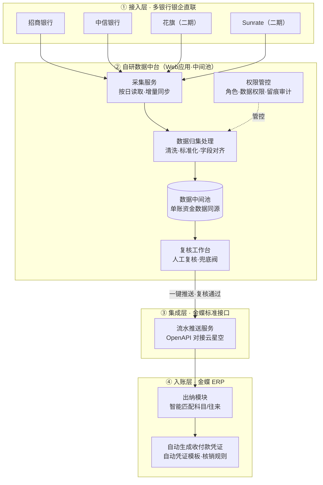
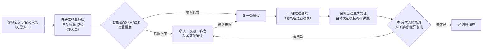
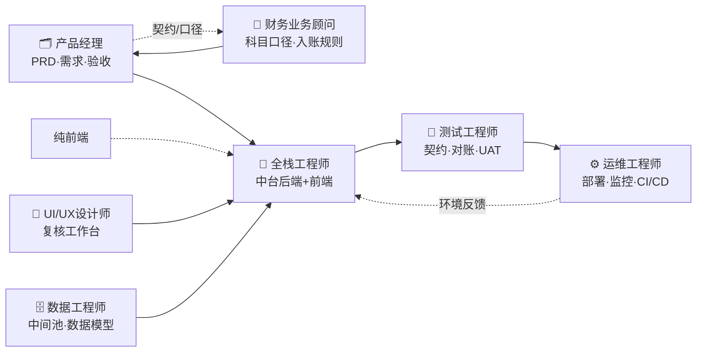

<title>财务流水自动入账项目 — 立项与架构设计（v2）</title>

<callout emoji="📋">
**决策入口**：本文档请求决策者审批一期立项方向、预算（约 2.15 万元一次性 + 年费 0.15 万元）、排期（9 月底上线）与**投入的角色型 Agent 人力**，并逐项确认「待定问题」清单。不行动基准：维持人工入账，月耗 6–10 人天、勾稽差异频发、月末结账周期长，随流水增长持续恶化。
</callout>

# 项目总览

## 背景与问题

当前财务侧银行流水入账完全依赖人工操作，通过飞书表格导入 + 手工逐笔入账完成，存在**跨系统数据割裂、重复操作量大、对账繁琐、月末结账周期长**等问题。随公司体量增加，出入款流水逐年递增，人工模式效率低、易错、追溯难、勾稽差异频发，已无法匹配财务标准化、精细化、合规化管控要求。

<callout emoji="💡">
**不行动的代价**：流水逐年递增，人工产能无法线性扩展；勾稽差异随量级放大，月末结账周期持续拉长，合规审计风险上升。
</callout>

## 项目本质

不是「再买一个工具」，而是**自建数据中台作为数据中间池**，把散落在各银行的流水统一归集、校验、复核后，推送金蝶自动生成凭证，实现**可控自动化（human-in-the-loop）**——自动化替代机械重复，人工保留在关键复核节点，保障账务严谨性。

## 三大目标

1. **多银行自动入账**：多银行流水自动采集、数据校验、数据自动同步、金蝶自动入账，替代流水环节全量手工操作。
2. **自研数据中台**：搭建数据中间池，支持未来财务个性化报表输出，提升数据灵活性。
3. **合规与效率**：提升结账效率、降低对账差异、强化资金账务合规性。

## 项目收益

| 维度 | 收益说明 |
|-|-|
| **效率** | 一期释放财务月度 6–10 天手工做账产能，减少对账、入账机械工时，缩短月末结账周期 |
| **质量** | 数据同源统一，减少人工录入差错与勾稽差异，提升账务准确性与税务合规性 |
| **拓展** | 自研库支持个性化功能迭代，可实现内部流水报表全自动输出，预留发票联动等扩展 |
| **成本** | 银行侧招商首年免费、中信免费；金蝶侧模块年费低，整体投入可控 |

# 项目分期与范围

项目分三期推进，自动化率阶梯爬升，收益逐期放大。

| 期次 | 上线时点 | 自动化率 | 月省人天 | 范围 |
|-|-|-|-|-|
| **一期** | 9 月底 | >80% | 6–7 人天 | 打通银行→自研→金蝶链路，覆盖中信 & 招商全账户 |
| **二期** | 10 月底 | 99% | 7–8 人天 | 新增花旗、Sunrate 等银行接口，覆盖率拉升 |
| **三期** | Q4 迭代 | 99%+ | 10–12 人天 | 发票信息、资金简报等拓展功能迭代 |

# 项目落地形式

## 总体形态：内部 Web 应用

本项目的落地形式为**自研内部 Web 应用（B/S 架构）**，部署在公司内网，财务用户通过浏览器访问。它不是一个对外营销网站，也不是重载的桌面客户端，而是面向财务团队内部使用的数据中台系统。核心由两部分构成：

- **后端服务层**：承担银行流水采集、数据归集处理、金蝶推送衔接等后台逻辑。
- **前端业务台（Web 界面）**：承担流水复核、凭证确认、分主体/账户/币种的表格化展示。

## 一期 MVP 范围（做薄）

| 模块 | 一期（MVP，必须） | 二期/三期（增强，后置） |
|-|-|-|
| **接入与采集** | 中信/招商银企直联数据接入、按日增量采集 | 花旗、Sunrate 等更多银行 |
| **数据中台** | 基础归集、清洗标准化、条件校验 | 丰富数据字典、报表引擎 |
| **复核工作台** | 精简 Web 复核页，凭证确认 + 一键推送 | 分主体/账户/币种的完整可视化 |
| **权限系统** | 简版登录 + 角色大致区分（操作留痕） | 细粒度权限、审计、SSO 集成 |
| **金蝶联动** | OpenAPI 推送、自动凭证模板、核销规则 | 回写状态、差异对账 |

<callout emoji="💡">
**推荐结论**：一期采用**精简 Web 应用**落地，把「功能闭环跑通」放在「界面与权限做到完美」之前。完整站点形态与细粒度权限迁移到二期/三期。
</callout>

# 总体技术架构

系统分为四层，各层职责清晰、松耦合、可替换、可扩展。

## 各层职责

| 层级 | 职责 | 关键设计点 |
|-|-|-|
| **接入层** | 多银行流水自动采集 | 中信/招商已有银企直联基础；二期扩展花旗、Sunrate；接口标准化以便扩展 |
| **数据中台** | 按日读取、数据校验、归集处理、权限管控、人工复核 | 统一数据字段、对齐金蝶接入格式；作为数据中间池，支撑个性化报表 |
| **集成层** | 基于金蝶 OpenAPI 推送流水数据 | 标准接口对接金蝶云星空，实现抓取→复核→推送闭环 |
| **入账层** | 金蝶出纳模块智能匹配科目/往来，自动生成凭证 | 依赖出纳模块加购、自动凭证模板、核销规则 |

<callout emoji="🔴">
**合规敏感区**：银行流水只有对方户名/金额/摘要，**没有发票、费用属性、往来明细**。若「智能匹配科目/往来」全自动、无兜底，一旦匹配错误会直接放大勾稽差异——与项目「消除勾稽差异」的目标背道而驰。因此必须在**复核节点**做人工兜底。
</callout>

# 核心业务链路与人工参与点

全链路自动化 + 关键复核兜底，端到端闭环。下图以**菱形节点 + 圆形头图标**标注需要人工参与的环节：

## 人工参与点清单

| 节点 | 参与人 | 做什么 | 是否可裁剪 |
|-|-|-|-|
| **① 智能匹配兜底** | 财务 | 低置信度流水的人工复核，逐笔确认科目/往来 | 否（合规必留） |
| **② 复核工作台** | 财务 | 对复核结果批量/逐笔确认，复核即出证，一键推送 | 否（核心兜底） |
| **③ 月末对账** | 财务 | 月末对账抽检、差异复核，勾稽验证 | 否（结账必需） |
| **④ 权限与告警** | 系统管理员 / 财务主管 | 账号权限分配、异常告警处置、接口不可用时人工兜底 | 部分（异常态） |
| **⑤ 银行/金蝶联调** | 技术 + 财务 | 样数据确认、映射规则评审 | 一次性的实施期工作 |

<callout emoji="💡">
**复核工时控制**：复核定位为「凭证生成结果的兜底阀」而非逐条重录入账。支持批量、一键过，避免复核工时反噬「月省 6-7 人天」的收益目标。
</callout>

# 预算与人工成本

## 成本构成

| 项目 | 费用 | 性质 |
|-|-|-|
| 中信银行银企直联 | 免费 | 无额外收费 |
| 招商银行银企直联 | 首年免费 | 次年起 200 元/月运维 |
| 金蝶·出纳管理模块 | 1,500 元/年 | 新增模块 |
| 金蝶·技术部署费 | 约 2 万元 | 一次性（凭证模板 + 联调部署） |
| 内部人力 | 0.3 HC | 2 个月总周期，净投入约 3 周 |

内部人力职责：银行接口对接、自研 Web 应用搭建、配合金蝶数据联调。

<callout emoji="💡">
**成本敏感性结论**：一次性成本大头是金蝶部署联调费（约 2 万元，占初次货币投入 >90%），年化持续成本极低。这意味着**重排期、保质量**优先于省成本。
</callout>

# 组织与多角色 Agent 协作

本项目以**多个角色型 Agent 协作**的方式组织交付。每个角色承担真实专业职能，跨角色协同完成全栈开发、界面设计、财务口径对齐、质量保障与运维部署。角色框架如下：

## 角色 Agent 定义与职责

| 角色 | 类型 | 职责 | 主要交付物 |
|-|-|-|-|
| **产品经理（PM）** | 编排型 | 需求拆分、前后端与设计任务编排、范围与优先级决策、验收把关 | PRD、任务看板、验收标准 |
| **财务业务顾问（BA）** | 领域专家 | 科目/往来映射口径、入账规则、银行字段含义、金蝶口径对齐 | 财务口径文档、映射规则 |
| **全栈工程师（FE）** | 开发型 | 自研 Web 应用后端 + 前端实现，银行接口接入，金蝶 OpenAPI 开发 | 可运行代码、接口对接文档 |
| **UI/UX设计师（UI）** | 设计型 | 复核工作台的界面设计与交互，表格化展示（分主体/账户/币种） | 界面稿、设计规范、可复用组件 |
| **数据工程师（DB）** | 开发型 | 数据中间池的表结构、ETL、清洗校验、权限模型与留痕 | 数据模型、ETL 逻辑、数据字典 |
| **测试工程师（QA）** | 质量型 | 接口契约测试、数据校验测试、对账/勾稽验证、UAT、回归 | 测试用例、对账报告、UAT 记录、上线放行单 |
| **运维工程师（OPS）** | 部署型 | 应用部署、环境配置、监控告警、CI/CD、异常兜底 | 部署脚本、监控告警、运维手册 |

## 跨角色协作关键

- **契约先行**：PM 组织 BA / FE / DB 先对齐「统一数据契约」（字段规范、对齐金蝶格式），避免后期返工。
- **设计前置**：UI/UX 在 FE 开发前端前先行产出复核工作台设计稿与交互原型，减少返工。
- **质量门禁**：QA 横切所有环节，凭证/对账结果不达标即退回。
- **口径唯一来源**：所有财务科目/入账规则的最终解释以 BA 为准，避免多方歧义。

# 实施计划与里程碑

## 一期详细路径（角色 Agent 对应）

| # | 实施项 | 内容 | 主导角色 |
|-|-|-|-|
| 1 | 自研数据库架构搭建 | 中间池表结构、采集/归集/权限模型 | 数据工程师 |
| 2 | 银行接口打通 | 落地中信、招商银企直联对接 | 全栈工程师 |
| 3 | 输入数据规范确认 | 统一数据字段，对齐金蝶接入格式标准 | PM / 财务顾问 / 数据工程师 |
| 4 | 金蝶系统联调开发 | 自研库与金蝶云星空 OpenAPI 对接，实现抓取→复核→推送闭环 | 全栈工程师 |
| 5 | 复核工作台搭建 | UI 设计复核界面，FE 实现人工复核 + 一键推送 | UI + 全栈工程师 |
| 6 | 系统配置与上线 | 模块加购、自动凭证模板、核销规则落地，9 月底一期上线 | 全栈 + 运维 |
| 7 | 测试与优化 | 契约测试、对账验证、UAT、试运行优化 | 测试 + 运维 |

## 里程碑节奏

| 里程碑 | 时点 | 交付标志 |
|-|-|-|
| **契约对齐** | 启动即完成 | PM 组织统一数据契约，冻结接口/字段/格式 |
| **链路打通** | 9 月中旬 | 端到端演示跑通：采集→归集→复核→推送→凭证 |
| **一期上线** | 9 月底 | 中信+招商全账户流水自动化，>80% 覆盖 |
| **二期上线** | 10 月底 | 新增花旗/Sunrate，覆盖率 99% |
| **三期迭代** | Q4 | 发票联动、资金简报等增值功能 |

# 风险与护栏

| 风险 | 说明 | 影响 | 缓解措施（护栏） |
|-|-|-|-|
| **科目匹配错误** | 流水缺发票/费用属性，全自动匹配易错 | 勾稽差异放大 | 高置信自动过 + 低置信转人工复核；复核即出证 |
| **一期排期超载** | 完整站点+细粒度权限过重 | 9 月底无法上线 | 一期做薄 Web 应用，重保链路；完整站点后置 |
| **联调失败/返工** | 金蝶 OpenAPI 兼容性、格式不对齐 | 联调周期拉长 | 契约先行冻结；QA 契约测试提前介入；预留联调 buffer |
| **权限合规** | 资金数据敏感，访问失控 | 合规与审计风险 | 权限管控 + 全程留痕可审计 + 高层背书授权 |
| **复核工时反噬** | 复核流太重抵消收益 | 人天收益缩水 | 复核定位为凭证兜底阀，支持批量、一键过 |
| **银行接口不可控** | 第三方接口异常/变更 | 流水中断 | 异常重试 + 告警 + 人工兜底切换 |

<callout emoji="💡">
**机制化护栏**：本项目自动化推进同样适用——**需高层背书、全程留痕可审、强管控环节（凭证生成）不实行全自动、先试点后推广**，把合规风险从机制层面压制到可接受范围。
</callout>

# 待定问题清单

以下问题需要决策者逐项确认，将直接影响排期、范围与上线承诺。建议按优先级逐项拍板：

| 编号 | 待定问题 | 候选选项 | 影响 | 贝鑫 | 小棵 |
|-|-|-|-|-|-|
| **Q1** | 一期中间池形态 | A. 精简 Web 应用（推荐）   B. 完整站点 + 细粒度权限 | 决定一期排期可行性 |  |  |
| **Q2** | 金蝶「智能匹配」一期策略 | A. 只做高确定性场景（推荐）   B. 全自动智能匹配 | 合规风险与勾稽差异 |  |  |
| **Q3** | 银行对接的商务/权限前置 | A. 立即推进申请   B. 待立项通过后推进 | 前置周期，影响 9 月底上线 |  |  |
| **Q4** | 自研 Web 应用技术选型 | A. 全栈框架（如 Next/Spring…）   B. 低代码平台 | 开发效率与可维护性 |  |  |
| **Q5** | 数据中间池部署环境 | A. 公司内网服务器   B. 云服务器 | 合规、成本与运维 |  |  |
| **Q6** | 招商银行次年起运维费 | A. 接受 200 元/月   B. 评估替代方案 | 长期成本（Q4 复核） |  |  |
| **Q7** | 三期发票联动范围 | A. 纳入本期立项   B. 三期单独再立项 | 三期范围与预算 |  |  |
| **Q8** | 权限模型粒度 | A. 一期简版（推荐）   B. 一期即上细粒度 | 一期工作量 |  |  |

<callout emoji="⏰">
**最优先确认**：Q1（一期形态）、Q2（智能匹配策略）、Q3（银行商务前置）。这三项直接决定能否兑现「9 月底上线」承诺。
</callout>

# 落地路径与下一步

1. **确认待定问题**：优先拍板 Q1 / Q2 / Q3，锁定一期范围和形态。
2. **冻结契约**：PM 组织财务顾问、全栈、数据工程师输出统一数据契约，作为所有角色开工依据。
3. **确认银行授权与金蝶采购**：落地中信/招商银企直联权限、金蝶出纳模块加购与部署联调立项。
4. **搭建 Web MVP**：UI 出复核界面设计、全栈工程师完成采集/归集/推送闭环。
5. **测试与 UAT**：QA 完成契约测试、对账勾稽验证，财务侧 UAT，随后 9 月底一期上线。

# 关键参考

<blockquote>
招行接口：<a href="https://openbiz.cmbchina.com/doc-detail?bizkey=DCCT20201214145038074&amp;subclass=1&amp;treeID=2026062909220930543">招商银行-欢迎您</a>

中信接口：<source name="中信银行银企直联接口说明书(集团客户)V6.0.0.1.doc" href="https://internal-api-drive-stream.feishu.cn/space/api/box/stream/download/authcode/?code=MGMxMWUxMGE0YTEyN2JmYWFjYjBhMzY3NDYxYmM3N2RfYWMyNWFhMzJmNTUzOWI2MTRiNzI4MDg4NTMxNTNlZjJfSUQ6NzY3NzQ4MTA0MDY4ODQwMTM0NV8xNzg3NTY0MTIxOjE3ODc1Njc3MjFfVjM" mime="application/msword" size="2239499" token="VWNRbVOx1ovFJ9xZl3zcJX0Un7b"/>
</blockquote>

- 金蝶云星空 · OpenAPI 接口文档
- 飞书云文档 · 财务流程自动入账背景说明（token: NKL3do8oBoJ3jIxNKOfcVqbCnih）