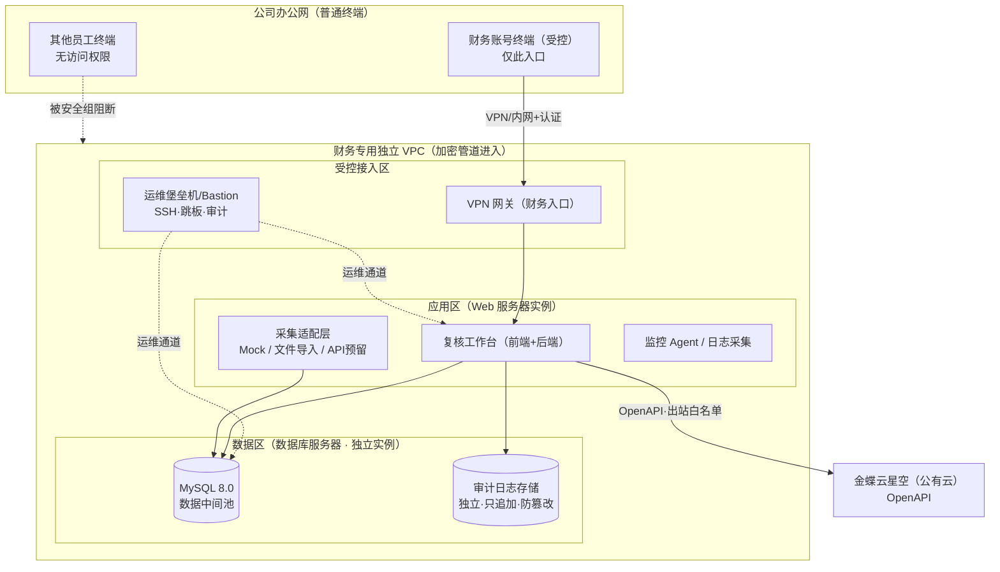

<title>财务流水自动入账项目 — 部署与安全隔离方案（v1）</title>

# 部署与安全隔离方案（运维工程师 · 工作项8 / 工作包4）

> **定位**：本方案是运维工程师 Agent 对一期「部署与隔离」工作的落地设计，承接项目基线安全约束（数据库与服务器独立部署、与办公网隔离、仅财务账号可访问、接口鉴权、关键操作留痕审计、不写死密钥凭据），并落地已锁定决策 **D1=独立云 VPC、D2=简版账号+角色、D7=MySQL 8.0**，部署形态采用 **Docker Compose**。
>
> **关联工作项**：本方案对应工作项 8（部署与隔离，09-04~09-10）；其中「发布/回滚」部分同步支撑工作项 11（一期上线与平稳，09-28~09-30）。
>
> **依赖**：待数据工程师库表结构（MySQL 8.0）与全栈工程师技术栈/环境变量清单输出后，本文档中的实例规格、备份策略、发布脚本细节将二次定稿（详见第 10 章待确认项）。

---

## 一、方案目标与原则

| 目标 | 达成方式 |
|-|-|
| **独立部署** | Web 层与数据库层分实例部署在独立云 VPC，互不可直连办公网 |
| **办公网隔离** | 生产数据面不暴露于公司普通办公网段；仅经受控入口（堡垒机/VPN）访问 |
| **仅财务可访问** | 应用层简版登录 + 角色分权，默认拒绝、按需放行 |
| **接口鉴权** | 前后端、采集适配、金蝶推送各接口均校验身份/令牌 |
| **可审计** | 关键操作（采集/复核/推送/登录/配置变更）全链路留痕，独立、只追加、防篡改 |
| **凭据安全** | 密钥/凭据不写死，集中注入，按环境隔离 |
| **可回滚** | Docker Compose 标签化镜像 + 一键回滚，异常时快速恢复托底 |

**安全设计总原则**：**默认拒绝、最小暴露、纵深隔离、全程留痕**。资金数据敏感，暴露面每少一寸，风险低一分。

---

## 二、整体部署拓扑

基于 **独立云 VPC**（D1）设计，分三个逻辑区段：受控接入区、应用区、数据区。办公网普通终端与生产区完全隔离。

**要点**：
- **Web 与 DB 分实例**：即使应用被攻破，数据库不直接暴露；DB 安全组仅对应用区实例端口开放。
- **办公网零信任接入**：生产区不对办公网网段开放服务端口，财务经 VPN 到达应用层；运维经堡垒机。
- **数据库双主机原则**：数据区独立实例 + 定期快照/备份，与应用故障隔离。
- **金蝶出站受限**：仅应用区到金蝶 OpenAPI 的受控出站白名单，不放开任意出网。

---

## 三、网络隔离设计

### 3.1 身份与网络划分（IAM → 子网 → 安全组）

| 层级 | 对象 | 规则 |
|-|-|-|
| **VPC** | 财务专用独立 VPC | 与办公网、其他业务 VPC 逻辑隔离；关键子网不启用公网 IP |
| **子网** | 应用子网 / 数据子网 | 数据子网私有，不直连互联网 |
| **安全组** | 行级防火墙 | 默认拒绝，显式放行 |

### 3.2 安全组规则草案（默认拒绝 + 白名单）

| 方向 | 源 | 目的 | 端口/协议 | 用途 |
|-|-|-|-|-|
| 入站 | VPN 网关 | 应用实例 | 443/TCP | 财务浏览器访问复核台（TLS） |
| 入站 | 堡垒机 | 应用/DB 实例 | 22/TCP | 运维 SSH，仅堡垒机来源 |
| 入站 | 应用实例 | DB 实例 | 3306/TCP | 应用连库，仅应用区来源 |
| 入站 | 应用/DB | 审计存储 | 专用端口 | 审计写入（受控） |
| 出站 | 应用区 | 金蝶 OpenAPI 域名 | 443/TCP | 凭证推送（白名单域名） |
| 其余 | — | — | 全部 | **默认拒绝** |

> 办公网普通网段不入任何白名单；财务访问走 VPN，VPN 网关本身做账号/设备认证。

### 3.3 隔离与访问路径建议

| 场景 | 建议路径 | 备注 |
|-|-|-|
| 财务日常使用 | 办公网 → VPN（认证）→ 应用 443 | 一期优先；VPN 为受控入口 |
| 财务内网直连（局域网） | 办公网 → 财务专用网段 → 应用 443 | 若机房有条件，按网络可达性优化 |
| 运维管理 | 办公网 → 堡垒机 → 应用/DB | 审计统一收敛到堡垒机 |

---

## 四、访问控制（D2：简版账号 + 角色分权）

一期不上 SSO，做简版账号 + 角色区分，满足「仅财务可访问 + 操作留痕」基线。

| 角色 | 能力范围 | 是否可接触 |
|-|-|-|
| **财务（复核人）** | 复核流水、确认推送、查看看板 | 数据读写（自身职责内） |
| **财务主管** | 掌握复核 + 告警处置 + 看板全量 | 数据读写 |
| **审计/只读** | 查看流水与审计日志，不可改不可推送 | 数据只读 |
| **系统管理员** | 账号/角色维护、密钥注入、版本发布（运维侧） | 权限与配置 |

**要点**：
- 认证：简版账号 + 令牌会话；密码强策略（最小长度/复杂度/过期），失败锁定 + 登录留痕。
- 授权：后端接口做角色校验，前端隐藏不是唯一防线（**服务端鉴权为准**）。
- 最小权限：一个账号只给其职责内最小权限；管理员与财务复核分账号。
- 默认拒绝：新建账号默认无权限，逐项授权。

---

## 五、密钥与凭据管理（不写死）

满足「不得写死密钥/凭据」硬约束。

| 凭据 | 存放 | 交付 |
|-|-|-|
| 数据库密码 | 环境变量注入，Source: 部署时安全生成，不入仓库 | DB_PASSWORD |
| 金蝶 OpenAPI 凭据 | 部署环境变量/密钥服务，运行期注入 | KINGDEE_* |
| 应用会话密钥(JWT) | 部署时随机生成，环境变量注入 | APP_JWT_SECRET |
| 模拟银行 API 密钥 | 同上，测试/演示用 | MOCK_* |
| 云服务账号 | IAM 最小权限 + 访问密钥轮换 | — |

**规则**：
- 仓库内 **零密钥**；`.env` / `secrets` 一律 `.gitignore`。
- 生产与测试环境凭据隔离，互不复用。
- 传输全程 TLS；密钥不做明文日志。
- 轮换机制：具备能力的前提下密钥定期轮换 + 泄露即换。

---

## 六、审计方案（操作全链路留痕）

承接「关键操作写审计日志」+ 溯源要求（审计独立、只追加、防篡改）。

| 审计事件 | 记录内容 | 归属层 |
|-|-|-|
| 登录/登出/失败 | 账号、时间、来源 IP、结果 | 应用 |
| 采集批次 | 银行、账户、批次号、文件/接口、条数、结果 | 采集适配 |
| 校验异常 | 批次、record_id、异常类型、处置 | 中台 |
| 复核操作 | 谁、何时、对哪笔、通过/驳回、备注 | 复核台 |
| 推送金蝶 | record_id、复核人、时间、金蝶凭证号、结果 | 推送服务 |
| 配置/权限变更 | 管理员、变更对象、前后值、时间 | 系统 |

**要点**：
- 审计日志写入**独立存储**（表/卷），与应用业务库分离。
- **只追加**：不允许更新/删除操作；防篡改（权限隔离 + 可选完整性校验）。
- 与业务溯源表衔接（批次号 / record_id / 凭证号双向可查）。
- 保留策略：满足合规审计留存周期（建议 ≥ 3 年，待与财务/合规确认）。

---

## 七、监控与告警

| 维度 | 指标 | 告警阈值（草案） | 通知 |
|-|-|-|-|
| **服务健康** | 应用/DB/采集进程存活、接口可用性 | 不可用、5xx 骤增 | 运维 + 财务主管 |
| **采集任务** | 每日采集成功数、失败批次 | 失败批次 > 0、无新批次 | 运维 → 财务 |
| **金蝶推送** | 推送成功率、失败条数 | 成功率 < 100%、失败条数 > 0 | 运维 + 财务主管 |
| **性能风险** | CPU/内存/磁盘、连接数 | 阈值超限、磁盘 > 80% | 运维 |
| **安全事件** | 登录失败、越权尝试、异常来源 | 触发即告警 | 运维 |

**实践**：监控 Agent 采集指标；告警分级（P1 宕机/失败 / P2 降级 / P3 预警）；日志集中，支撑故障定位与审计。具体工具链待定（详见待确认项）。

---

## 八、数据安全与备份

| 项 | 方案 |
|-|-|
| **传输加密** | 公网/跨区链路 TLS；DB 与应用同 VPC 内网传输，仍建议启用加密连接 |
| **静态加密** | 云盘加密（应用与 DB 卷） |
| **备份** | MySQL 定期全量 + 增量；审计日志独立备份；保持恢复演练 |
| **保留** | 按合规要求；与财务/合规确认留存周期 |
| **恢复** | 发布/回滚章节的恢复预案（见第 9 章） |

---

## 九、发布 / 回滚（Docker Compose · 支撑工作项11）

| 阶段 | 动作 |
|-|-|
| **镜像** | CI 构建带版本标签镜像（app:v1.x.y），推私有镜像仓库 |
| **编排** | docker-compose 定义 app / db / audit / monitor 服务；依赖 .env（不入库） |
| **发布** | `docker compose pull + up -d`，滚动/最小停机更新；发布前备份 + 健康检查 |
| **验证** | 健康检查通过 → 金蝶推送冒烟 → 财务抽验（UAT） |
| **回滚** | 保留上一版本标签，`docker compose up -d --用上一版本镜像` 一键回退；数据变更前先备份 |
| **平稳** | 试运行期（09-28~09-30）监控金蝶推送成功率、采集成功率、复核量，异常即回滚 |

> 发布脚本、回滚脚本、运维手册作为工作项11交付物，随本文档细化。

---

## 十、待确认项

| 编号 | 待确认 | 影响 | 依赖方 | 截止 |
|-|-|-|-|-|
| **O1** | 具体云厂商/区域（D1 只定了独立云 VPC） | 拓扑/安全组落地 | 本人 + 公司云环境 | 工作项8启动前 |
| **O2** | 数据库实例规格/备份周期 | DB 侧清单 | 数据工程师（库表定稿） | 09-04 |
| **O3** | 技术栈/环境变量清单/镜像仓库 | 编排与发布脚本 | 全栈工程师 | 09-05 |
| **O4** | 办公网内网直连 or 仅 VPN | 访问路径 | 本人 + IT | 09-04 |
| **O5** | 监控/日志工具选型 | 第7章落地 | 本人 | 09-06 |
| **O6** | 审计/日志留存周期（合规） | 保留策略 | 财务/合规 | 09-06 |

---

## 十一、交付物清单（工作项8）

| # | 交付物 | 状态 |
|-|-|-|
| 1 | 部署拓扑 + 安全组规则清单（本文档第 2/3 章） | ✅ 本版 |
| 2 | 访问控制方案（简化登录 + 角色） | ✅ 本版 |
| 3 | 密钥/凭据管理约定 | ✅ 本版 |
| 4 | 审计方案（独立·只追加·防篡改） | ✅ 本版 |
| 5 | 监控告警清单 | ✅ 本版（工具待定） |
| 6 | 发布/回滚脚本 + 运维手册 | ⏳ 工作项11交付 |
| 7 | 部署实施记录 & 访问权限审计 | ⏳ 09-04~09-10 |

---

## 十二、与我方协作接口

- **数据工程师**：库表（MySQL 8.0）定稿 → 确定 DB 规格/索引/备份 → 反哺 O2。
- **全栈工程师**：技术栈、环境变量清单、采集任务调度方式 → 支撑 O3 与发布脚本。
- **测试工程师**：UAT 前访问权限审计、发布验证 → 联动工作项10/11。
- **本人/财务**：金蝶 OpenAPI 凭据、银行网络连通、合规留存周期 → O6 等。

---